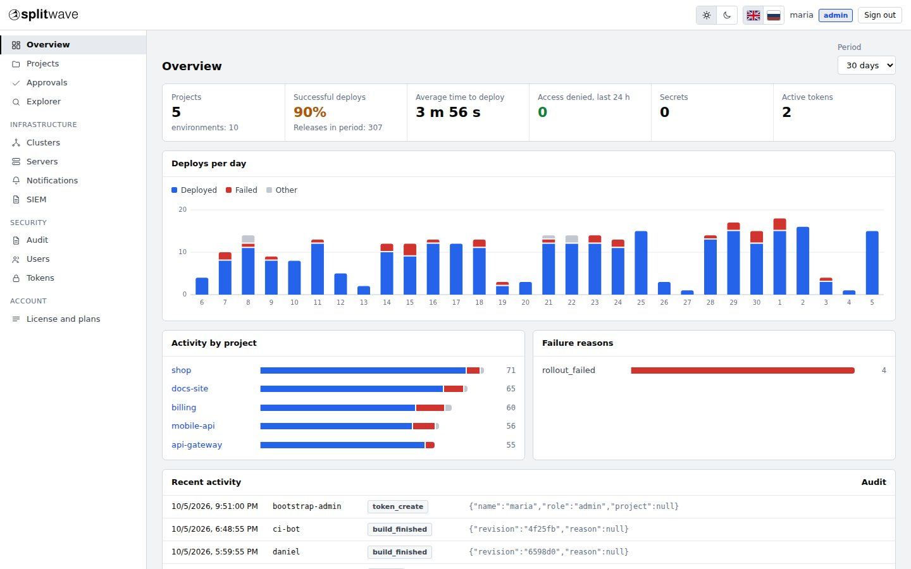
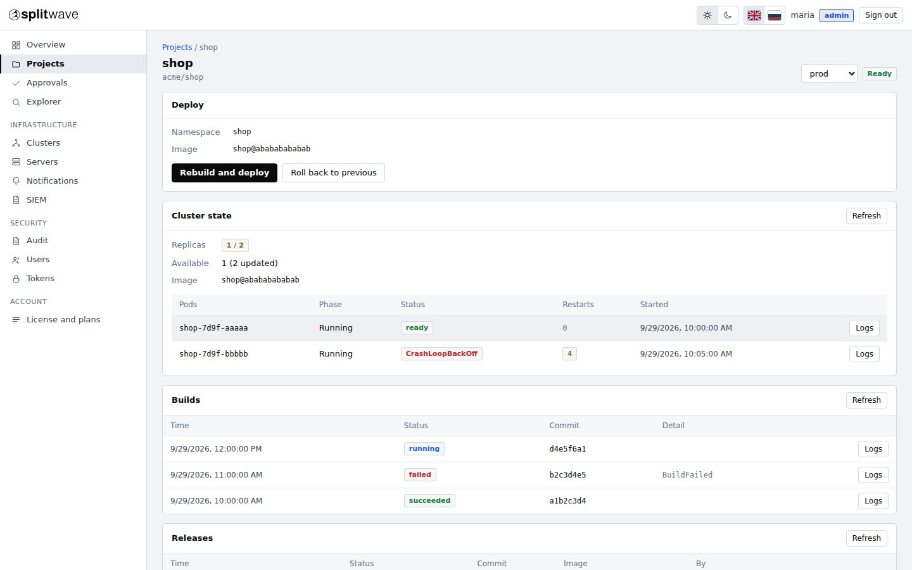
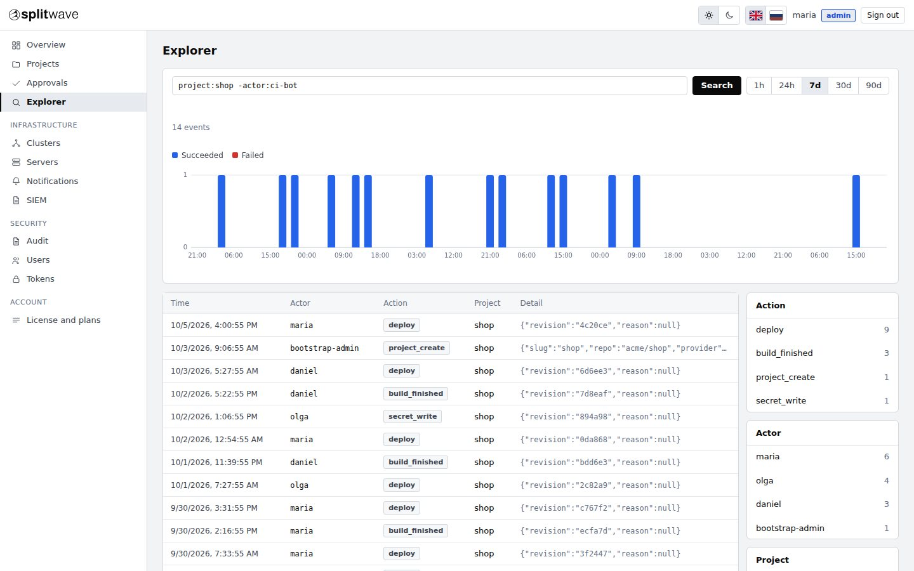
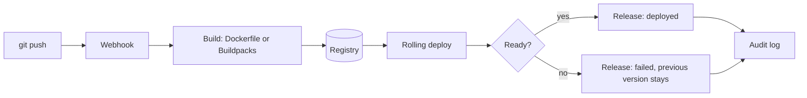

<p align="center">
  <picture>
    <source media="(prefers-color-scheme: dark)" srcset="docs/img/logo-white.svg">
    
  </picture>
</p>

<p align="center">
  <b>Self-hosted deployment platform with built-in security.</b><br>
  Push to deploy. Roll back in one click. Every action audited.
</p>

<p align="center">
  <a href="LICENSE"></a>
  
  
  
</p>

<p align="center">
  <a href="https://split-wave.com">Website</a> ·
  <a href="docs/quickstart.md">Quick start</a> ·
  <a href="docs/README.md">Documentation</a> ·
  <a href="https://split-wave.com/pricing">Plans</a> ·
  <a href="#support-the-project">Support the project</a>
</p>

<p align="center">
  <picture>
    <source media="(prefers-color-scheme: dark)" srcset="docs/img/overview-dark.jpg">
    
  </picture>
</p>

## Why SplitWave

You connect a Git repository, and every push is built, rolled out, audited and reversible. It runs on your own infrastructure, keeps your secrets encrypted, and sends nothing about you out: no telemetry, no licence server. The only outgoing request is an optional once-a-day read of a public file with the latest version number (nothing is sent; switch it off with `UPDATE_CHECK=false`).

- **Three clicks to a first deploy.** Paste a repository link. The platform detects the language, the Dockerfile and the port, and prepares the application.
- **A failed rollout does no harm.** A release counts as deployed only when the application really started. On a crash the previous version stays in place and you see why.
- **Security is not an add-on.** Encrypted, versioned secrets; a tamper-evident audit log; approvals and two-factor sign-in; least privilege by default.
- **Yours to run.** One command installs it on a server, or use the Helm chart in your own Kubernetes cluster.

## Features

| | |
|---|---|
| **Push to deploy** | Your Dockerfile, a Dockerfile the platform suggests, or Cloud Native Buildpacks. GitHub, GitLab, Bitbucket Cloud, Gitea and Forgejo. |
| **One-click rollback** | Return to any earlier release without rebuilding. Rollbacks are releases too and are audited. |
| **Secrets** | Encrypted at rest, versioned, never shown again, masked in logs. `.env` import, expiry and rotation reminders. |
| **Audit** | Every action in a hash chain, with chain verification. Search events in the Explorer. |
| **Approvals and access** | Four-eyes approval for risky deploys, roles per project, TOTP two-factor sign-in, API tokens. |
| **External services** | Step-by-step connection check (DNS, TCP, TLS, login) for databases, caches and object storage. |
| **Domains and TLS** | Automatic certificates, or your own certificate with validation. |
| **Notifications** | Slack-compatible webhooks, Telegram and signed webhooks for failures, approvals and expiring secrets. |

## Screenshots

<table>
  <tr>
    <td width="50%"><picture><source media="(prefers-color-scheme: dark)" srcset="docs/img/project-dark.jpg"></picture><br><sub>A project: cluster state, builds and releases</sub></td>
    <td width="50%"><picture><source media="(prefers-color-scheme: dark)" srcset="docs/img/explorer-dark.jpg"></picture><br><sub>Explorer: find any event with a simple query</sub></td>
  </tr>
</table>

## Quick start

On a clean Ubuntu 22.04/24.04 or Debian 12 server with 4 GB of RAM:

```bash
sudo ./deploy/quickstart/install-single-node.sh \
  --chart ./deploy/helm/splitwave \
  --image <registry>/control-plane:<version> \
  --host panel.example.com --email you@example.com
```

The installer sets up Kubernetes (k3s), a registry and the platform in about five minutes, and prints the address, the administrator token and the **secrets encryption key** (keep a copy of it). Then open the panel and choose *Projects, Connect repository*. More in the [quick start](docs/quickstart.md) and the [installation guide](docs/install.md).

## How it works



## Free core and plans

The core in this repository is source-available under the [Elastic License 2.0](LICENSE) and free to use on your own servers, including for commercial projects. You may not offer it to others as a hosted or managed service and may not circumvent the licence-key functionality, including the plan limits. Paid plans add capacity and extra features, delivered as a separate module that is enabled by an offline-verified licence key.

| | Community | Lite | Pro | Max |
|---|---|---|---|---|
| Price | Free | $20 / month | $100 / month | $200 / month |
| Projects (Projects module) | 1 | 5 | 25 | unlimited |
| Environments per project (Environments module) | 1 | 3 | 10 | unlimited |
| User accounts, roles and project members (Teams module) | 1 admin | 3 | 10 | unlimited |
| PR preview environments | no | 3 | 20 | unlimited |
| Audit export | no | yes | yes | yes |
| SSO, SIEM export, several clusters, servers with an agent | no | no | yes | yes |
| Support | bug reports | bug reports | bug reports | bug reports |

Support is through bug reports only: no live chat, phone or guaranteed response time. The software is used at your own responsibility. Yearly billing gives two months free. When a licence expires the paid modules switch off and the installation continues as Community; nothing is deleted. Existing projects, environments and accounts stay visible, but new ones cannot be added and only the first project and its first environment deploy automatically on push. Details: [plans and licences](docs/plans-licensing.md), [pricing](https://split-wave.com/pricing).

## Security

Secrets are encrypted with a key you keep and masked in logs. In the default mode the platform can only change the image of an existing Deployment. Application namespaces are hardened, outbound requests are guarded against SSRF, and the licence signing key never lives on a web server. Read the [security model](docs/security.md) and the [security policy](SECURITY.md).

## Status

SplitWave is in active development. The repository wizard, builds, deploy and rollback, the single-server installer and the console are working and tested end to end. Please review it before you run production workloads.

## Roadmap

- A web application firewall as a platform feature (after v1.0).
- More Git hosts and registries.
- More languages for the console and the documentation.

## Documentation

Start with the [documentation index](docs/README.md): [quick start](docs/quickstart.md), [connecting a project](docs/connect-project.md), [secrets](docs/secrets.md), [API](docs/api.md), [troubleshooting](docs/troubleshooting.md).

## Support the project

The free core is built and maintained by one person. If it saves you time, you can support its development:

| Network | Address |
|---|---|
| USDT / TRX (TRC20) | `TJYQEhXTyncKjURSctYYxC864rAr54mS8L` |
| ETH / USDT (ERC20) | `0xAe7A12F85B4498c1E578ee02286D7fb10184901c` |

More ways and QR codes: <https://split-wave.com/support>. Buying a plan supports the project too. Thank you.

## Contributing

Issues and pull requests are welcome; see [CONTRIBUTING.md](CONTRIBUTING.md). A Contributor License Agreement is required before the first pull request is merged.

## License

The core is released under the [Elastic License 2.0](LICENSE) (source-available, not an OSI open-source licence). The paid modules are proprietary and are not part of this repository: see [LICENSE-COMMERCIAL.md](LICENSE-COMMERCIAL.md).

---

<p align="center"><sub>© 2026 Koratech · <a href="https://split-wave.com">split-wave.com</a></sub></p>
